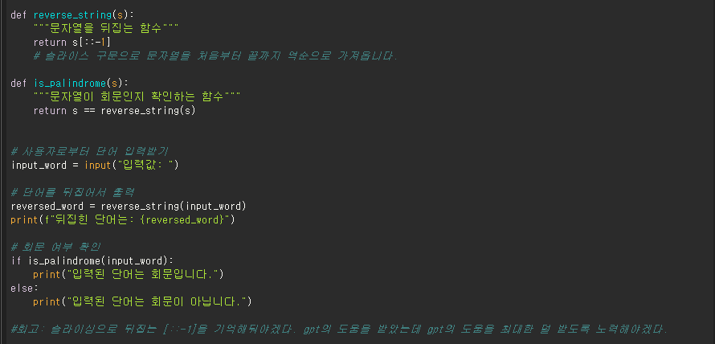
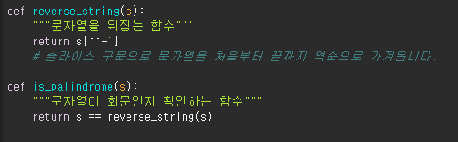

# AIFFEL Campus Online Code Peer Review Templete
- 코더 : 방미선
- 리뷰어 : 조정민


# PRT(Peer Review Template)
- [O]  **1. 주어진 문제를 해결하는 완성된 코드가 제출되었나요?**
    [O] 단어를 입력받을 수 있게 한다.
    [O] 입력된 단어를 뒤집어서 출력할 수 있게 한다.
    [O] 입력된 단어가 회문이 맞는지 확인하여 출력할 수 있게 한다.
    [O] 자료형, 제어문, 함수를 활용한다.
     
    
- [O]  **2. 전체 코드에서 가장 핵심적이거나 가장 복잡하고 이해하기 어려운 부분에 작성된 
주석 또는 doc string을 보고 해당 코드가 잘 이해되었나요?**
   각 코드마다 주석으로 처음보는 사람이 봐도 이해하기 쉽도록 처리되어 있어 인상적이었습니다..
     
        
- [O]  **3. 에러가 난 부분을 디버깅하여 문제를 해결한 기록을 남겼거나
새로운 시도 또는 추가 실험을 수행해봤나요?**
    제 머리로 디버깅 해봤을 때 오류가 나지 않았습니다.
        
- [O]  **4. 회고를 잘 작성했나요?**
    페어 프로그래밍을 통해 부족한 문법에 대해 다시 한번 되돌아보시는 부분이 잘 느껴졌습니다.
        
- [O]  **5. 코드가 간결하고 효율적인가요?**
    중복된 코드를 줄이기 위해 문자열을 뒤집는 함수와 문자열이 회문인지 확인 하는 함수를 직접 만들어 사용하시는 모습이 인상적이었습니다.
    
# 회고(참고 링크 및 코드 개선)
```
저희 팀 코드와 비교해 봤을 때 저희 팀이 만든 코드에서 함수를 직접 만들어서 시도해봤으면 어땠을까 싶은 아쉬움이 남도록 느끼게 해줘서 좋았습니다 :)
```
