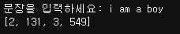
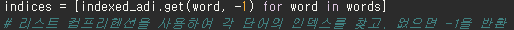
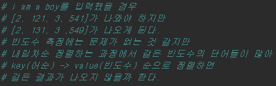
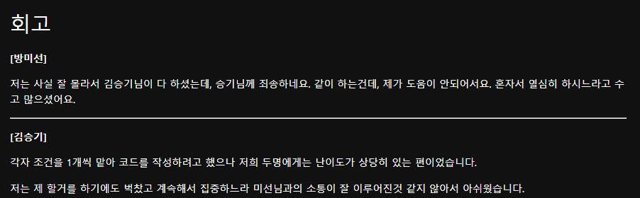
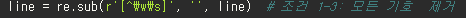

# AIFFEL Campus Online Code Peer Review Templete
- 코더 : 방미선 
- 리뷰어 : 조정민


# PRT(Peer Review Template)
- [O]  **1. 주어진 문제를 해결하는 완성된 코드가 제출되었나요?**
     
    
- [O]  **2. 전체 코드에서 가장 핵심적이거나 가장 복잡하고 이해하기 어려운 부분에 작성된 
주석 또는 doc string을 보고 해당 코드가 잘 이해되었나요?**
    
    찾는 단어가 없을거라는 경우의 수를 생각해 get()로 없을 경우 -1을 반환하는 부분이 재밌었습니다.
        
- [O]  **3. 에러가 난 부분을 디버깅하여 문제를 해결한 기록을 남겼거나
새로운 시도 또는 추가 실험을 수행해봤나요?**
    
    주석문을 통해 출력 예시와 출력값에 대한 차이에 대한 자세한 설명과 해결법을 제시해놓으며 설명하는게 대단하다고 생각합니다.
        
- [O]  **4. 회고를 잘 작성했나요?**
    
    회고를 보면서 저희 팀에서 작성한 회고와 비슷하게 어려웠다는  느낀점이 있어 인상깊었습니다.
        
- [O]  **5. 코드가 간결하고 효율적인가요?**
    
    저희 코드랑 비교해봤을 때 특수문자를 제거하는 부분에서 위 코드처럼 더욱 간결 코딩할 수 있었겠구나 배우게됐습니다.

# 회고(참고 링크 및 코드 개선)
```
저희 코드보다 더욱 상세하게 설명했고 특히 출력 예시와 출력값이 다른 부분에 대해 주석문으로 보충 설명을 작성해놓은 부분이 인상적이었습니다.
```

